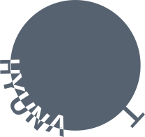
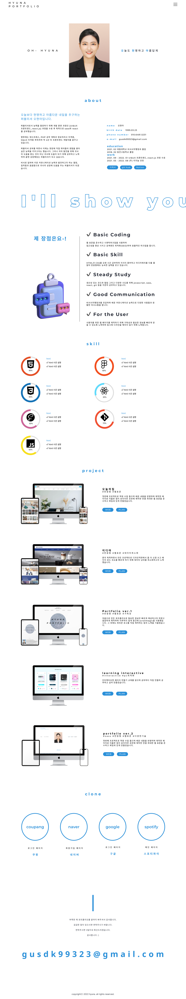

# portfolio2
#  HYUNA portfolio
## 포트폴리오 소개
- 나를 알릴 수 있는 주요 내용과 필요한 내용만을 깔끔하게 전달하는 것이 목적
- 포인트 색상과 중간에 infinite animation을 이용한 배너를 넣어줌으로써 재미요소를 더함
- scrollmagic을 이용하여 스크롤에 효과를 넣어줌
- flex box를 이용한 레이아웃 제작
- 320px, 768px, 1280px, 1440px, 1920px을 반응형으로 제작

## 제작 기간
- 6일 &#45; 7일 소요
- 디자인 &#8594; html &#38; Sass &#8594; Sass &#38; javascript &#8594; 반응형 &#8594; 최종 검토 단계로 진행

## 로고 소개
- 기본 로고는 깔끔하게 작성하고자 하여 특별히 제작하지 않았음

- favicon을 눈에 띄는 이미지로 넣어주고자 제작
- 이름을 활용하여 한눈에 알아보기 쉽고 유니크하게 로고를 만들고자 함
- 오현아라는 이름을 한글과 영어를 이용하여 로고 제작
- '오' + 'hyuna'를 사용하여 이와 같은 로고 생성

## 사용기술
- HTML
- SASS
- JavaScript
- scrollmagic을 활용한 애니메이션

## 보완사항
- 리액트를 공부하기 시작했을때 제작하여 아직 "react" 적용 포트폴리오를 만들지 못했음  
-> 리액트를 추가적으로 공부하여 리액트를 적용한 포트폴리오를 만드는 것이 목표

---
## <a href="https://hyuna99323.github.io/portfolio2/" color="#000">HYUNA PORTFOLIO</a>

click me🖱️

  

